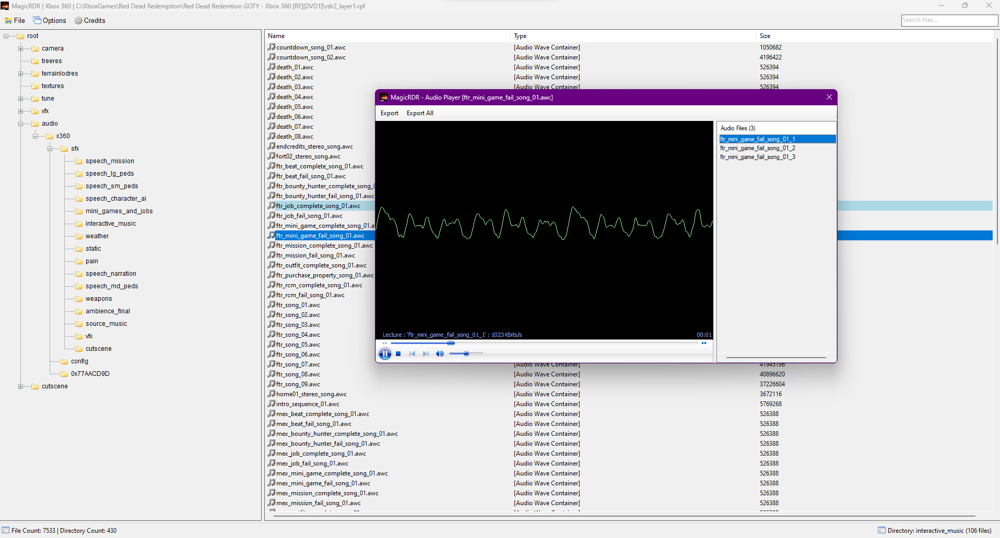
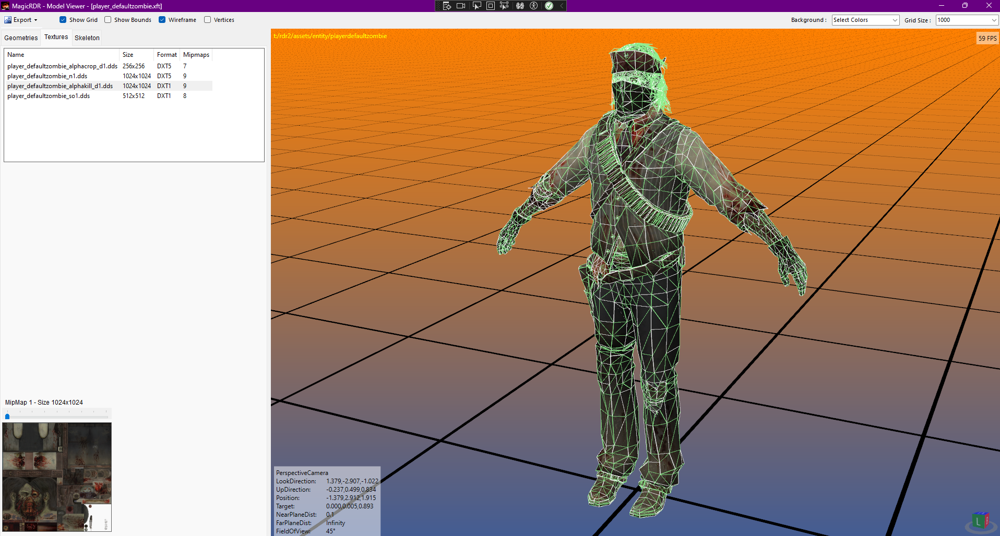
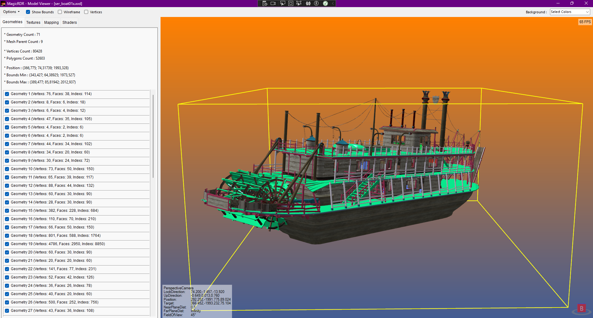
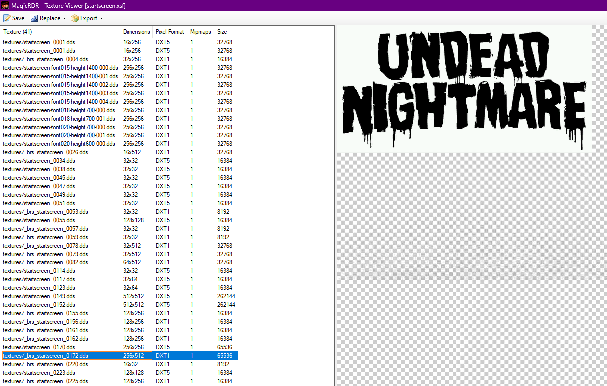
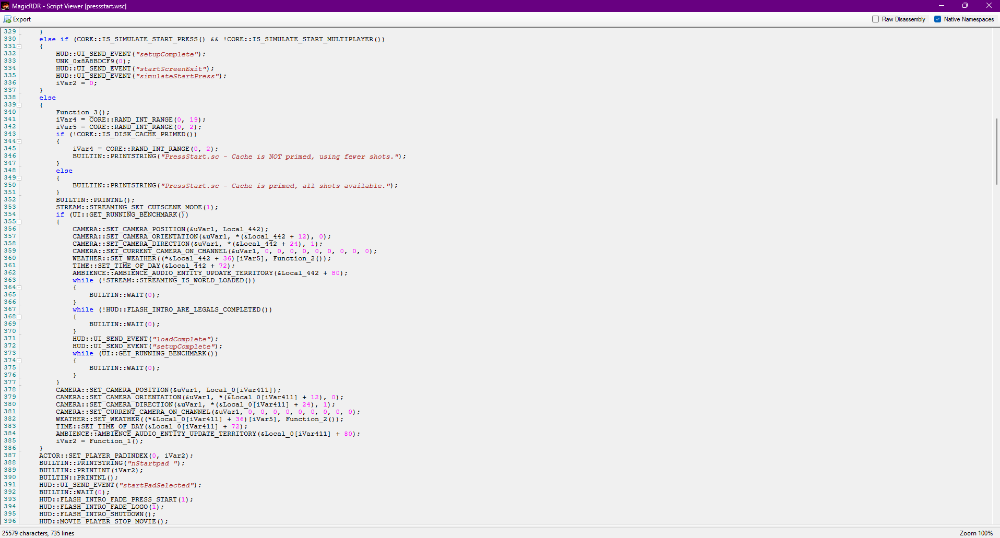

# Magic RDR v1.3.6

RPF Editor for Red Dead Redemption

Supports Xbox 360, Nintendo Switch (and potentially PS4/PS5) versions.                   
Some features are supported only for Xbox (.xsf, .awc, etc.)

# Features
 - Add/remove files/directories
 - Basic Hex viewer
 - Hash generator
 - Script decompiler (#sc)
 - Texture viewer & editor (#td, #sf, #ft, #fd, #vd)
 - Model viewer (#ft, #fd, #vd, #bd)
 - Basic sector data viewer (#si)
 - Basic shader data viewer (.fxc, .nvn)
 - Stringtable viewer (#st)
 - Audio player (.awc)

# Credits
- Im Foxxyyy
- XBLToothPiick
- revelations
- Sockstress
- apii intense
- aru

# Helpers
- CabooseSayzWTF
- GuiCORLEONEx794
- FrostDragonZ
- OAleex

# Random Pictures

