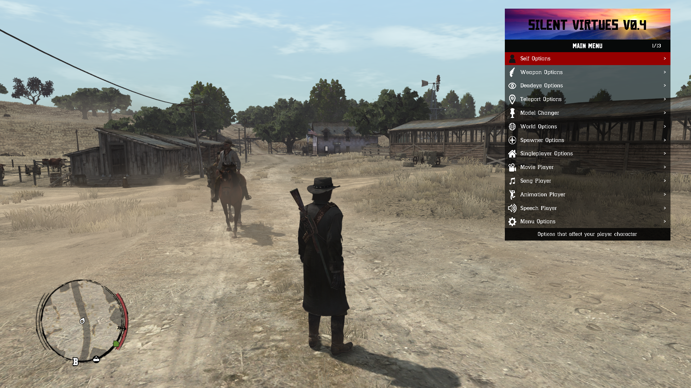

# Magic RDR v1.3.7

RPF Editor for Red Dead Redemption (no longer in active development)

If you want to mod the PC or Nintendo Switch versions you can also take a look at [CodeX](https://github.com/Foxxyyy/CodeX.Games.RDR1)

This tool supports the Xbox 360, Nintendo Switch, PS4 & PC platforms.                   
Some features are only supported for the Xbox version which was the main target originally (XSF, AWC, etc.)

# Features
 - Add/remove files/directories
 - Basic Hex viewer
 - Basic Hash generator
 - Basic Sector data viewer (#SI)
 - Basic Shader data viewer (.FXC, .NVN)
 - Script decompiler (#SC)
 - Texture viewer & editor (#TD, #SF, #FT, #FD, #VD)
 - Model viewer (#FT, #FD, #VD, #BD)
 - Stringtable viewer (#ST)
 - Audio player (.AWC)

# Credits
- Im Foxxyyy (Mars)
- XBLToothPiick
- revelations
- Sockstress
- apii intense
- aru
- emoose
- TheRouletteBoi

# Helpers
- CabooseSayzWTF
- GuiCORLEONEx794
- FrostDragonZ
- OAleex
- BadassBaboon

# Random Pictures

We are also working on a [ScriptHook ASI trainer](https://www.youtube.com/watch?v=74zuDQ8vYAs) if interested :)                                                  

